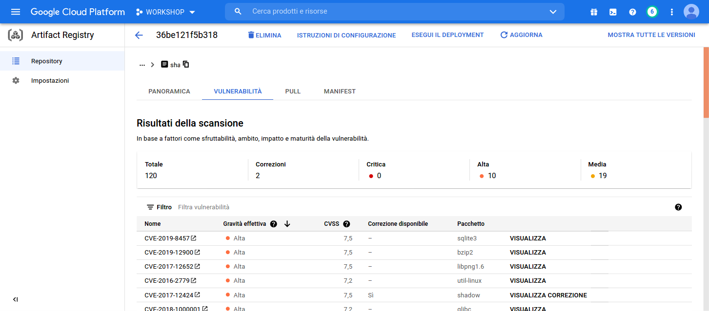

# Workshop - CI/CD with Google Cloud Platform

This workshop repository contains exercises for a GCP DevOps CI/CD pipeline using mainly:

## Requirement

*   Google Cloud Platform User Account
*   Google Cloud Platform SDK (>= 331.0.0)
*	Docker
*	JAVA 1.8
*   Maven 3

## Excercise 7 - Scanning vulnerabilities
**Artifact Registry** enable to scan pushed images using the **GCP Container Scanning**

##### 1. Enabling container scan
In order to scan container images **containerscanning.googleapis.com** must be enabled running the below command:

	gcloud services enable containerscanning.googleapis.com

##### 2. Pushing Docker image to Artifact Registry to scan

###### Enabling Artifact Registry Service
To trigger a container scan for an Artifact registry Docker image, enable Artifact Registry (if not already enabled) executing the following command:

	gcloud services enable artifactregistry.googleapis.com

###### Creating a GCP Docker Artifact repository

	gcloud artifacts repositories create docker-repository \
	--repository-format=docker \
	--description="GCP Artifacts repository for Docker images" \
	--location europe-west4

After creating the Docker repository you can check for the created repository with `gcloud artifacts repositories list` and set it as defualt for your Cloud SDK

	gcloud artifacts repositories list --location europe-west4

	REPOSITORY         FORMAT  DESCRIPTION                                 LOCATION      LABELS  ENCRYPTION          	CREATE_TIME          UPDATE_TIME
	docker-repository  DOCKER  GCP Artifacts repository for Docker images  europe-west4          Google-managed key  2021-03-13T15:57:43  2021-03-13T15:57:43

Set as default
	
	gcloud config set artifacts/repository docker-repository
	

###### Pushing Docker image to a GCP Artifact Docker repository
To be able to push builded docker images Docker must be configured running `gcloud auth configure-docker` command as below

	gcloud auth configure-docker europe-west4-docker.pkg.dev
	
Response:

	Adding credentials for: europe-west4-docker.pkg.dev
	After update, the following will be written to your Docker config file
	 located at [/root/.docker/config.json]:
	 {
	  "credHelpers": {
	    "staging-k8s.gcr.io": "gcloud",
	    "us.gcr.io": "gcloud",
	    "marketplace.gcr.io": "gcloud",
	    "europe-west4-docker.pkg.dev": "gcloud",
	    "gcr.io": "gcloud",
	    "asia.gcr.io": "gcloud",
	    "eu.gcr.io": "gcloud"
	  }
	}
	
	Do you want to continue (Y/n)?  y
	
	Docker configuration file updated.	
	
After configuring **Docker** your are able to build and push the image to your **Google Artifacts** repository pointing to the repository as:

	LOCATION-.pkg.dev/PROJECT/REPOSITORY/IMAGE

Example:

	europe-west4-docker.pkg.dev/workshop-307013/docker-repository/workshop-us63:1.7.0
  	

###### Pushing Docker Image to **Artifact Registry**

	# Build Docker image
	docker build -t workshop-us63 .
	
	# Tag the image
	docker tag workshop-us63 europe-west4-docker.pkg.dev/workshop-307013/docker-repository/workshop-us63:1.7.0
	
	# Push to Docker repository
	docker push europe-west4-docker.pkg.dev/workshop-307013/docker-repository/workshop-us63:1.7.0
	

##### 3. Check Image vulnerabilities 
After pushing the Docker image to the Artifact Registry Docker repository, run the following code in order to list the vulnerabilities:

	gcloud artifacts docker images describe europe-west4-docker.pkg.dev/workshop-307013/docker-repository/workshop-us63/nginx-test@sha256:48d56bae87c65ca642b0a1d13c3dc97c4430994991e5531ff123f77cdf975fae --show-package-vulnerability

Vulnerability report is also available on Google Cloud Console as shown below:

##### 4. Clean up

- **Delete docker images:**

	  gcloud artifacts docker images delete europe-west4-docker.pkg.dev/workshop-307013/docker-repository/workshop-us63:1.7.0

- **Delete the created Docker repository**:

	  gcloud artifacts repositories delete docker-repository --location europe-west4

