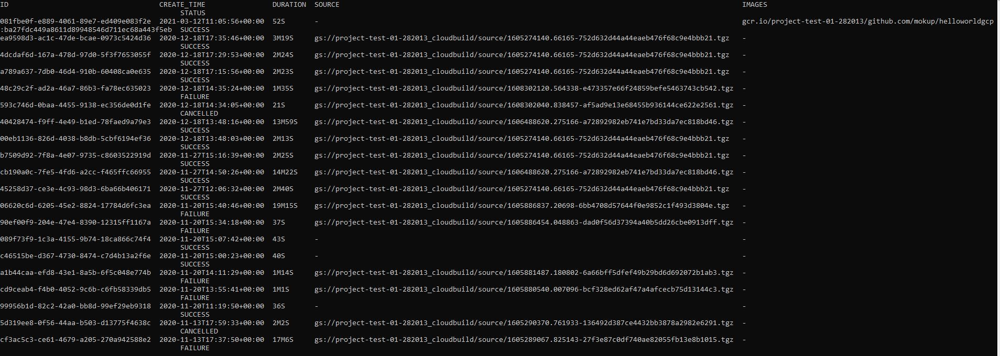
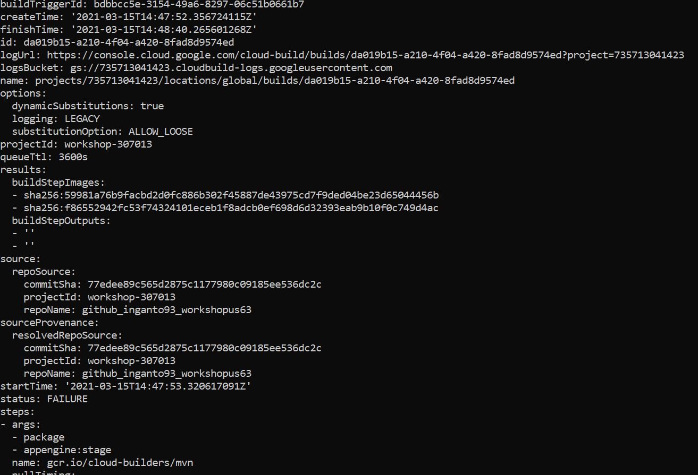

# Workshop - CI/CD with Google Cloud Platform

This workshop repository contains exercises for a GCP DevOps CI/CD pipeline using mainly:

## Requirement

*	Google Cloud Platform User Account

## Install Google Cloud SDK
The purpose of this document is to guide user to install google cloud sdk on S.O. Windows

#### Download
You can view all builds by use the command:

`gcloud builds list`

and you obtain an output as the following:

Or You can filter this list using the option --filter, for example: 

*	`gcloud builds list --filter status="FAILURE"`

	to view only builds whose compilation failed 

*	`gcloud builds list --filter "create_time>"2021-03-15T00:00:00+00:00" AND create_time<"2021-03-16T18:43:49+00:00""`

	to view all builds created between 2021/03/15 and 2021/03/16

#### Build detail
If you want to see detail of a specific build, you can use command:

`gcloud builds describe [BUILD_ID]`

example:

`gcloud builds describe [BUILD_ID]`

and then

`gcloud builds describe da019b15-a210-4f04-a420-8fad8d9574ed`

and as response you obtain some information of build

	
