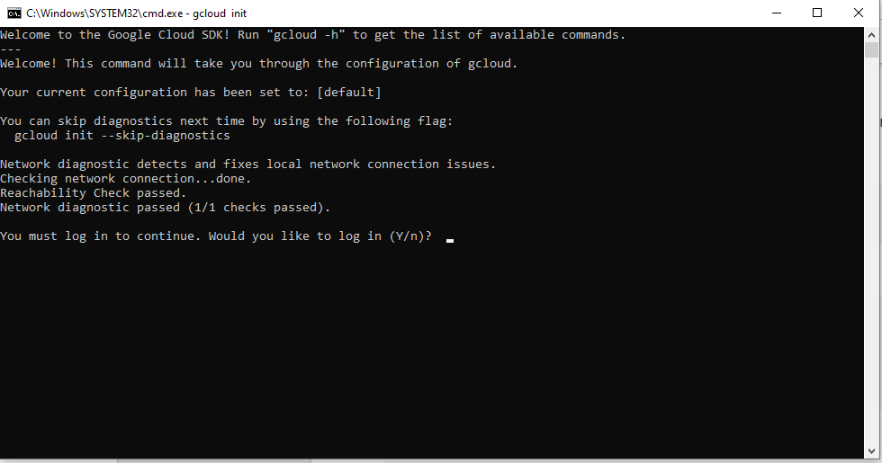

# Workshop - CI/CD with Google Cloud Platform

This workshop repository contains exercises for a GCP DevOps CI/CD pipeline using mainly:

## Requirement

*	Google Cloud Platform User Account

## Install Google Cloud SDK
The purpose of this document is to guide user to install google cloud sdk on S.O. Windows

#### Download
To download de installer package of Google Cloud SDK you have two alternatives:

*	You can access to site: [cloud.google.com/sdk/docs/install](http://cloud.google.com/sdk/docs/install) And click on link **Cloud sdk installer** 

*	You can launch the follow command from the Windows Power Shell :

`(New-Object Net.WebClient).DownloadFile("https://dl.google.com/dl/cloudsdk/channels/rapid/GoogleCloudSDKInstaller.exe", "$env:Temp\GoogleCloudSDKInstaller.exe")`

and then

`& $env:Temp\GoogleCloudSDKInstaller.exe`

The next window is the following:

	

Press next and then you have to read and accept license 

	

Now, you have to choose if you want to install software only for your account or for all accounts of PC

	

Then select **directory** where install sdk

Check **Component** to install 

And After you press **Install** start download the software:

After a few minutes install will be completed

Finally we have to check where create shortcut of sdk

If you select **create start menu shortcut** in the previous window you can find shortcut in the start menu as in the following image

Now automatically will be opened sdk shell and you have to login with the credential of google account: 

Insert username and then insert the password

And in the follow windows press Allow to authorize Google Cloud Sdk to access at your Google Account:

Now you have to select the project you want to work on from those on which you are authorized

And finally choose a regional zone to use as project selected

Now you are ready to work with sdk on the selected project

