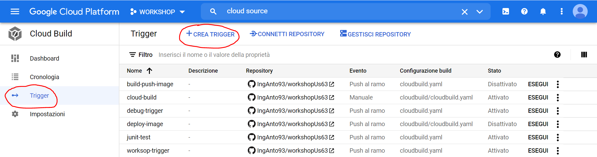

# Workshop - CI/CD with Google Cloud Platform

This workshop repository contains exercises for a GCP DevOps CI/CD pipeline using mainly:


## Requirement

*   Google Cloud Platform User Account
*   Google Cloud Platform SDK (>= 331.0.0)
*	Docker
*	JAVA 1.8
*   Maven 3

## Exercise 3 - Mirroring a GitHub repository

Go on GitHub and Sign In or Create a new account. 

Then, create a new repository clicking on `+`:



You should get on a new page, where you can choose repository name, its visibility and its initial setup. We recommend you to use the following configurations:


Click on Create repository. Now, you can clone this repository on your local machine, by getting its url from `Code` button as follows:


Copy-paste in the cloned repository the content of this Exercise Repository. You should have already cloned this repo in the last exercise, so just checkout on branch exercise-3 and copy all this code in order to paste it in your GitHub repository. Try to use the same branches structure, so create the branch exercise-3 e then push to your remote repository.

```
git add .
git commit -m "First commit"
git push origin main
```

When you mirror a repository, you must provide GitHub authentication credentials. These credentials let Cloud Source Repositories access the contents of the GitHub repository.

1. In the Google Cloud Console, open Cloud Source Repositories.

2. Click **Add repository**.

   

   The **Add a repository** page opens.

3. Select **Connect external repository** and click **Continue**.

   The **Connect external repository** page opens.

   

4. In the **Project** drop-down list, select the Google Cloud project to which the mirrored repository belongs.

   If you don't have a project, you can click **Create project** to [create a project](https://cloud.google.com/source-repositories/docs/creating-an-empty-repository#creating_a_project).

5. In the **Git provider** drop-down list, select **GitHub**.

6. Select the checkbox to authorize Cloud Source Repositories to store your credentials.

7. Click **Connect to GitHub**.

8. Sign in to GitHub with your machine user credentials.

9. Click **Authorize GoogleCloudPlatform**.

   This option grants Google Cloud read access to your repository.

   When authorization finishes, you're returned to the **Connect external repository** page. A list of repositories opens.

   

10. From the list of repositories, select the repository you want to mirror.

11. Click **Connect Selected Repository**.

    The main repository page opens. This page contains a list of the repositories for this Google Cloud project, including the new repository you just created.

After you set up mirroring, Cloud Source Repositories automatically syncs your repository with the mirrored repository when a user commits a change. Cloud Source Repositories lets you view the last time your mirrored repository was synced and manually force a sync if necessary.

1. In the GCP Console, browse to the mirrored GitHub repository.

2. Click **Settings** *settings*.

   The sync status is displayed.

   

3. To manually force a sync of the repositories, click **Sync from GitHub**.
