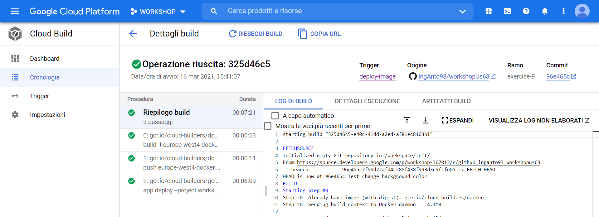

# Workshop - CI/CD with Google Cloud Platform

This workshop repository contains exercises for a GCP DevOps CI/CD pipeline using mainly:

## Requirement

*	Google Cloud Platform User Account
*	Google Cloud Platform SDK (>= 331.0.0)
*	Google Beta Commands
*	Docker
*	JAVA 1.8
*	Maven 3

## Exercise 8 - Working with Cloud Build: build and push a Docker image
The purpose of this exercise is to build and push the Docker image of your application to the previously created repository on **Artifact Registry**.

#### 1. Enabling Cloud Build Service

Before starting, you need to enable the cloud services (if not already enabled) related to Cloud Build and Artifact Registry executing the following command(s):

	gcloud services enable cloudbuild.googleapis.com
	gcloud services enable artifactregistry.googleapis.com
	
#### 2. Defining the build config

To build and push your image using Cloud Build you need to define a build config file (`cloudbuild.yaml` or `cloudbuild.json`) in your project sources with the following structure:

	steps:
	  - name: 'gcr.io/cloud-builders/docker'
		args: ['build', '-t', '${_LOCATION}-docker.pkg.dev/$PROJECT_ID/${_REPOSITORY}/${_IMAGE}:${_TAG}', '.']
	images:
	  - '${_LOCATION}-docker.pkg.dev/$PROJECT_ID/${_REPOSITORY}/${_IMAGE}:${_TAG}'

As you can see, you can define some variables whose values will be substituted at build time. Cloud Build provides built-in substitutions or you can define your own substitutions.

For instance, `$PROJECT_ID` is a built-in one and is substituted with the ID of your Cloud project, while `{_LOCATION}`, `{_REPOSITORY}`, `{_IMAGE}`, `{_TAG}` are custom and will help to tag the docker image and push it to your repository.

Cloud Build allows you also to build a Docker image using just a **Dockerfile**. In this case, you don't require a separate build config file.

**NOTE** that there in no explicit call to `docker push`, in fact, if you define in the _**images**_ section the newly built image, Cloud Build will automatically push it to the Artifact Registry repository.

#### 3. Creating the build trigger

To be able to run the build as you defined, you can create a build trigger that will execute any time it detects a push on the branch on which you configure it. You can create it running `gcloud builds triggers create` command as follows:

	gcloud beta builds triggers create cloud-source-repositories --name build-push-image /
	--repo github_inganto93_workshopus63 /
	--branch-pattern exercise-8 /
	--build-config cloudbuild.yaml /
	--substitutions _LOCATION=europe-west4,_REPOSITORY=docker-repository,_IMAGE=workshop-us63,_TAG=1.8.0
	
Response:

	Created [https://cloudbuild.googleapis.com/v1/projects/workshop-307013/triggers/56a0a97f-d602-4178-95e8-7f479133bedf].
	NAME              CREATE_TIME                STATUS
	build-push-image  2021-03-16T10:40:03+00:00
	
After creating the trigger you can check it using the following command:

	gcloud beta builds triggers describe build-push-image

You should get a response similar to the following:

	createTime: '2021-03-16T10:40:03.556457361Z'
	filename: cloudbuild.yaml
	id: 56a0a97f-d602-4178-95e8-7f479133bedf
	name: build-push-image
	substitutions:
	  _IMAGE: workshop-us63
	  _LOCATION: europe-west4
	  _REPOSITORY: docker-repository
	  _TAG: 1.8.0
	triggerTemplate:
	  branchName: exercise-8
	  projectId: workshop-307013
	  repoName: github_inganto93_workshopus63

You can also run this trigger manually using this command:

	gcloud beta builds triggers run build-push-image
	
#### 4. Triggering the build

Now that everything is set up, push any modification on your branch to trigger the build.

You can access the GCP console and go to the Cloud Build section to check that a build started from your trigger; choose it from the builds list to see its details:

#### 5. Checking pushed image

Once the build has successfully completed, you can check that the image was pushed to the repository using the command `gcloud artifacts docker images list` as follows:

	gcloud artifacts docker images list europe-west4-docker.pkg.dev/workshop-307013/docker-repository/workshop-us63 --include-tags

Response:

	IMAGE                                                                        DIGEST                                                                   TAGS    CREATE_TIME          UPDATE_TIME
	europe-west4-docker.pkg.dev/workshop-307013/docker-repository/workshop-us63  sha256:180649ed9c121c4dd16953e6a88dab3f490050208a67ed9ca4779b735beb00cd  1.8.0   2021-03-16T12:08:54  2021-03-16T12:08:54
	
#### 6. Cleaning up resources

After checking the image, delete it to avoid resource consumptions and costs.

##### Delete trigger:

	gcloud beta builds triggers delete build-push-image

##### Delete docker image:

	gcloud artifacts docker images delete europe-west4-docker.pkg.dev/workshop-307013/docker-repository/workshop-us63:1.8.0

If previously tagged images have not been deleted, you need to force tag deletion using the option _--delete-tags_:

	gcloud artifacts docker images delete europe-west4-docker.pkg.dev/workshop-307013/docker-repository/workshop-us63:1.8.0 --delete-tags
