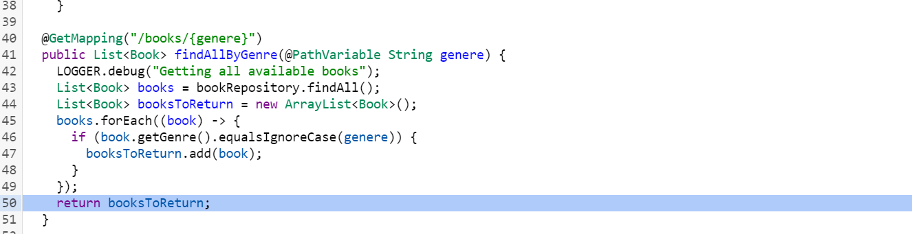
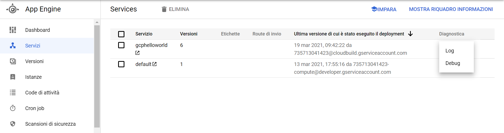

# Workshop - CI/CD with Google Cloud Platform

This workshop repository contains exercises for a GCP DevOps CI/CD pipeline using mainly:

## Requirement

*   Google Cloud Platform User Account
*   Google Cloud Platform SDK (>= 331.0.0)
*	Docker
*	JAVA 1.8
*   Maven 3
*   Enable Debugger API for your Google Cloud project and configure your environment and your app. These steps vary by language or framework used to implement the app. For Java and App Engine Standard, you just need to enable the Cloud Debugger API. 

## Exercise 4 - Debugging code

If you store your app's code in Cloud Source Repositories, you can use the source control to perform Cloud Debugger tasks. These include taking and viewing debug snapshots, adding logpoints, and viewing logpoint outputs. 

The debugging functionality in Cloud Source Repositories is an alternative to the functionality provided by Debugger in the Google Cloud Console. 

First of all, let's create a trigger to build and deploy this application on App Engine. Go to Cloud Build Console, and select `Trigger` -> `Create Trigger`:

You should get on a new page, where you need to specify a name for this trigger and other settings like the following ones:

Now click `Create` button. 

In Trigger page, you should see the newly created trigger. Execute it by clicking on `Execute` button and the on `Execute Trigger` button. This trigger will build and deploy the application on App Engine. In order to get its URL, go on *App Engine -> Services* and click on your service. This will redirect you to the external domain name of your service. Add to this domain name */workshop-us63* in order to see the index page of your application.

Application index page:

Now we can start debug, so leave application index page opened. 

Go on Cloud Source Repositories, select the mirrored repository from Exercise-2 and switch on branch exercise-3. Select the class *BookRestController.java*  and then you should see `Start Debugging` button: click on it.

You can do the following in Cloud Source Repositories:

- **Take debug snapshots**, which lets you view the state of local variables and the call stack in your app at specific points in your code.
- **Add logpoints to your code**, which lets you inject logging into a running service without restarting it or interfering with its normal function.

Let's begin with a snapshot.

1. Click the line number of the source code location.

   

2. When prompted, select the app you want to debug, and then click **Continue**.

   

3. Click **Create snapshot**.

   

   The new snapshot appears in an adjacent pane of the Google Cloud Console waiting for activation.

   

In order to activate the snapshot, let's go on the application index page and let's search for fantasy books, by typing *Fantasy* and clicking on `Submit`:

Going back on Cloud Source, you should see the snapshot output in the adjacent panel:

From here, you can delete the snapshot by clicking on `trash icon` o retake it by clicking on `arrow icon`.

You can also define a snapshot condition: is an expression that must evaluate to `true` for the snapshot to be taken. Expressions in Java, Python, and Go are supported. Snapshot conditions are evaluated each time any instance runs the line until the condition evaluates to `true` or the snapshot times out.

The condition is a full boolean expression that can include logical operators. Open the condition dropdown panel, insert the condition and then click `Retake` button:

Now, let's go again on the application index page and let's search for adventure books.

Going back on Cloud Source you should see snapshot output because condition is satisfied.

Let's delete this snapshot and set a **logpoint**. The process is exactly the same shown above but you need to choose, at point 3, **Create logpoint**.

You can define again a condition, if needed, the text to report in the log and its severity. Let's create one without condition, at information level, with text: *"Searched books={booksToReturn}"*. It will appear in adjacent panel:

Now, in order to trigger this log, let's go on the application index page and let's search for fantasy books again. To see this logs, we can go on App Engine -> Services -> ServiceName -> Tools -> Debug and this will get to Cloud Debugger, the other way, above mentioned, to debug in Google Cloud.

In Cloud Debugger, you can do exactly same things done in Cloud Source and you can also see logs clicking on panel `Log`:

In this panel you can find all application logs. If you want to search logs for logpoint go on `History` Panel, select your logpoint and click on dots -> Visualize log:

Now, you should see only logs related to your logpoint:

